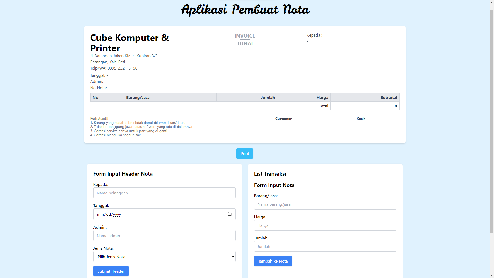

# 🧾 Aplikasi Cetak Nota

Aplikasi ini adalah solusi sederhana dan efisien untuk mencetak **nota** tanpa harus mencatat secara manual. Dibangun dengan **Tailwind CSS** untuk tampilan yang bersih dan responsif, aplikasi ini sangat cocok digunakan untuk bisnis skala kecil.

---

## ✨ **Fitur Utama**

- 🖨️ **Cetak Nota** dengan tampilan yang rapi dan mudah dibaca.
- ⚡ **Efisien**, tanpa membutuhkan database (input data manual).
- 🎨 **Desain Modern** menggunakan framework **Tailwind CSS**.
- 📄 **Ukuran Kertas Custom**: Cetak nota sesuai kebutuhan (A4 atau ukuran lain).
- 🧩 **Mudah Digunakan** langsung melalui browser.

---

## 📂 **Struktur Proyek**

```plaintext
├── node_modules       # Dependensi Node.js (folder)
├── src                # Sumber kode utama aplikasi (folder)
│   ├── input.css      # File input untuk Tailwind CSS
│   └── output.css     # File output hasil build Tailwind CSS
│── index.html         # File utama aplikasi
├── package-lock.json  # File lock untuk dependensi
├── package.json       # Informasi proyek dan dependensi
├── README.md          # Dokumentasi proyek
└── tailwind.config.js # Konfigurasi Tailwind CSS
```

---

## 🚀 **Cara Menggunakan**

1. **Clone atau Unduh Proyek**

   ```bash
   git clone https://github.com/fuadamsyari/Cetak-Nota-App.git
   cd Cetak-Nota-App
   ```

2. **Buka di Browser**

   - Buka file `index.html` menggunakan browser favorit Anda.

3. **Isi dan Cetak Nota**

   - Masukkan data pada kolom yang disediakan.
   - Klik tombol **Cetak Nota** untuk mencetak.

---

## 📸 **Tangkapan Layar**

### Tampilan Aplikasi




---

## 🛠️ **Teknologi yang Digunakan**

- **HTML5**: Struktur utama aplikasi.
- **Tailwind CSS**: Styling modern dan responsif.
- **JavaScript**: Fungsionalitas interaktif, termasuk pencetakan nota.

---

## 🌟 **Keunggulan**

- **Sederhana & Mudah Digunakan**: Dirancang untuk kemudahan dalam penggunaan sehari-hari.
- **Cepat & Ringan**: Tidak memerlukan server atau database.
- **Dapat Disesuaikan**: Layout nota bisa diubah sesuai kebutuhan pengguna.

---

## 👨‍💻 **Kontributor**

- [Ahmad Fuad Amsyari](https://github.com/fuadamsyari) - Pengembang dan Desainer Utama.

---

## 📜 **Lisensi**

Proyek ini dilisensikan di bawah [MIT License](LICENSE). Anda bebas menggunakannya untuk keperluan pribadi atau komersial.

---

> **💡 Tips:** Gunakan printer berkualitas untuk hasil cetakan nota terbaik, dan pastikan pengaturan kertas sudah sesuai.
